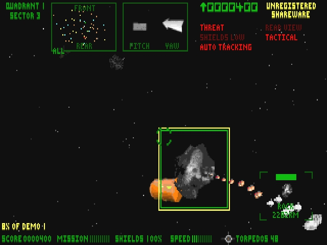

# Description
A re-imagining of the MS-DOS game Astro3D using the panda3d game engine.

# Requirements
- A C++17 compliant compiler
- `boost` and `panda3d` header directory in common UNIX include paths
- `boost` and `panda3d` shared libraries in common UNIX lib path
- WIP: libraries needed by `panda3d`

# Build instructions
See the Travis CI YAML config.

# Inspiration

